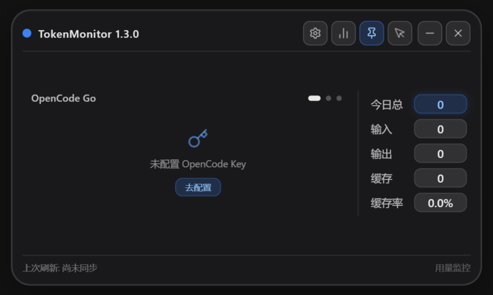
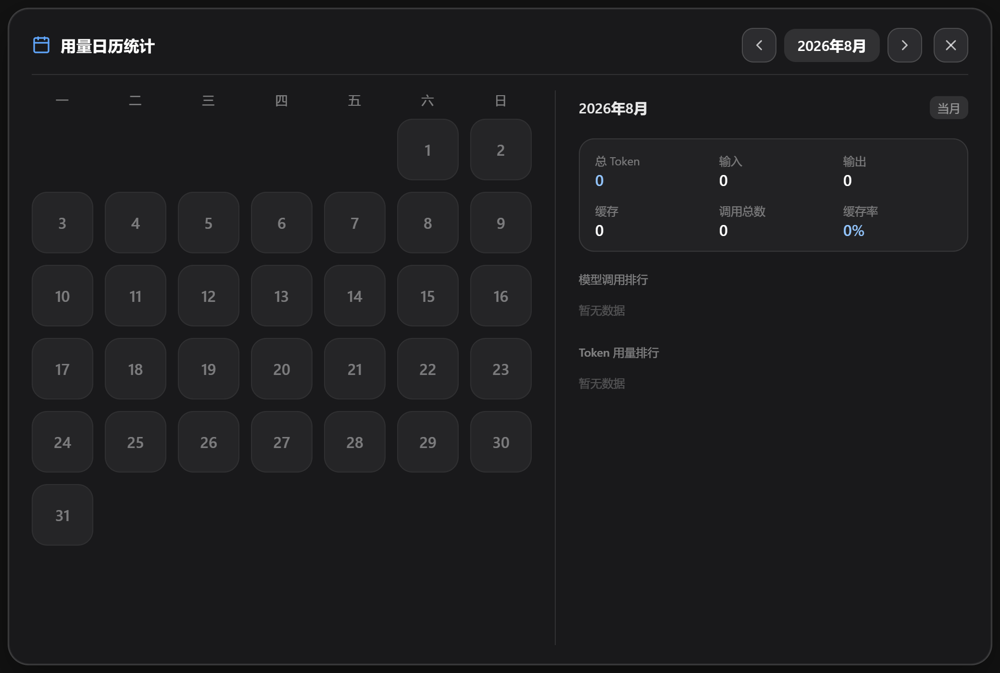

# TokenMonitor

> **专为 Vibe Coding 打造的开源多源 AI 用量与额度监控桌面磁贴** —— 无边框、置顶、可鼠标穿透的纯净毛玻璃悬浮小部件，支持 OpenCode Go、DeepSeek 官方、Google Gemini、OpenAI GPT 及本地全量 Token 统计。


---

## ✨ 核心特性

- 🎛️ **多通道 Coding Plan 自由轮播**：
  - **OpenCode Go**：`5H余额` / `本周余额` / `本月余额` 三环剩余百分比 + 精准重置倒计时。
  - **DeepSeek 官方**：实时账户可用余额（如 `¥ 48.65`）+ 当日动态消耗百分比环。
  - **Google Gemini**：一键网页 OAuth 授权绑定，支持 **Gemini 模型池** 与 **Claude 模型池** 双圆环独立剩余配额与重置倒计时，并根据 Google 返回的套餐信息显示 `Free`、`Plus`、`Pro` 或 `Ultra` 标识。
  - **OpenAI GPT**：应用内 ChatGPT OAuth 登录，按账号套餐显示 `Plus`、`Pro 5x` 或 `Pro 20x` 标识及实际 `5H余额` / `本周余额`，不依赖官方 Codex 客户端。Pro $100/月为 `Pro 5x`（接口值 `prolite`），Pro $200/月为 `Pro 20x`（接口值 `pro`）。
  - 每个通道支持绑定多个账号或 API，可在设置中命名管理，主界面使用上下箭头快速切换。
  - 刷新时所有账号都会参与获取；每个通道最多同时请求 5 个账号，哪个账号先完成就先显示哪个账号的数据。
  - 支持左右微光箭头与指示点平滑切页，四个通道的左右箭头保持统一高度，退出自动记忆停留在哪个通道。
- 📈 **今日全量 Token 统计**：今日总消耗 / 输入 / 输出 / 缓存 / 缓存率，右侧等宽数据块，来自本机多 Agent（OpenCode、Claude Code、pi、ZCode、Codex）本地综合采集，未启动期间消耗自动补全。
- 📊 **独立用量日历统计窗口**：居中大窗口月度贡献图，色块深浅反映当日用量，悬浮即看模型调用排行与详细指标；关闭即彻底销毁释放 Chromium 内存。
- ⏱️ **严格 60 秒并发调度**：各通道独立获取账号额度，每个通道最多 5 个账号并发；账号完成后立即更新对应数据，网络耗时不影响 60 秒固定周期。
- 🪟 **纯净 DirectComposition 磨砂质感**：基于 Windows 原生 GPU 透明合成，无黑框、无蓝底、失焦不闪烁，极简通透。
- 🖱️ **鼠标穿透与置顶**：快捷键 `Ctrl+Shift+P` 一键切换鼠标穿透，置顶常驻桌面不挡操作，按下 `Win+D` 也不会被最小化。
- 🍃 **极低后台内存开销**：常驻仅约 30MB 内存，轻量省电。

---

## 📸 界面预览

| 主磁贴（OpenCode / DeepSeek / Gemini / GPT） | 用量日历统计窗口 |
| :---: | :---: |
|  |  |

---

## 🚀 快速开始

### 安装

前往 [GitHub Releases](https://github.com/Hanfei1224/TokenMonitor/releases) 下载最新安装包 `TokenMonitor Setup 1.4.0.exe`，一键安装即可。本版本只发布 Windows NSIS 安装版，不提供绿色便携版。

> 安装版及 Electron 持久化数据都位于安装目录：配置文件为 `config.json`；升级安装会自动保留其中的 API 凭证。开发版使用工作区内的 `.dev-data/config.json`，与安装版相互隔离。GPT refresh token 也保存在该文件中，但仍使用 Windows 安全存储加密。

### 快捷键与操作

| 操作 / 快捷键 | 功能说明 |
| :--- | :--- |
| **`Ctrl + Shift + P`** | 切换鼠标穿透（点击穿透到下层窗口） |
| **点击左/右箭头** | 切换 Coding Plan（OpenCode $\leftrightarrow$ DeepSeek $\leftrightarrow$ Gemini $\leftrightarrow$ GPT） |
| **点击上/下箭头** | 切换当前通道内的账号或 API |
| **点击右上角 ⚙** | 打开多通道设置面板（支持 API Key 配置、Google 登录与 ChatGPT 登录） |
| **点击右上角 📊** | 唤起居中用量日历统计 |
| **托盘图标右键** | 刷新数据、设置置顶/穿透、退出程序 |

---

## 🛠️ 本地开发与构建

```bash
# 1. 克隆仓库
git clone https://github.com/Hanfei1224/TokenMonitor.git
cd TokenMonitor/src

# 2. 安装依赖
npm install

# 3. 本地开发调试
npm run dev

# 4. 生产构建
npm run build

# 5. 构建 Windows NSIS 安装包
npm run build:installer
```

---

## 📄 开源许可

本项目基于 [MIT License](LICENSE) 开源。
