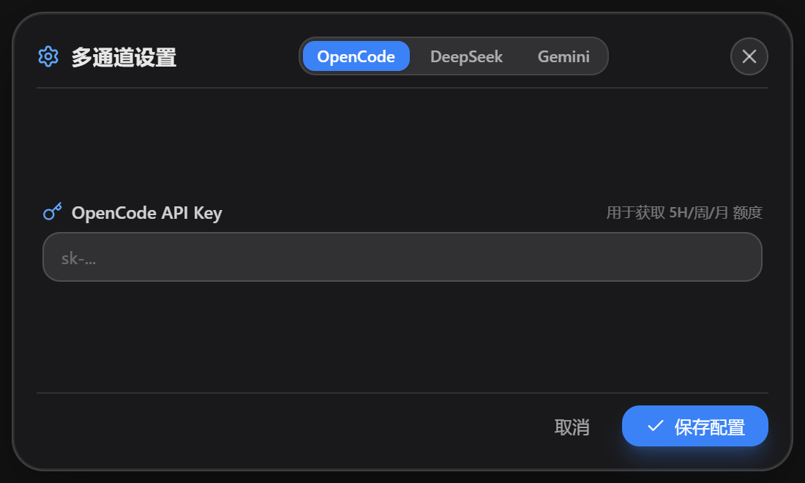

# 【神器推荐】TokenMonitor：专为 AI 编程打造的桌面用量与额度监控小组件！

> **告别额度焦虑，开启沉浸式 Vibe Coding 心流体验。**
> 一款开源、轻量、高颜值的桌面透明监控磁贴，支持 **OpenCode Go、DeepSeek 官方、Google Gemini Pro（含 Claude / Gemini 双额度池）** 以及全量本地 Token 消耗统计。

---

## 💡 为什么需要 TokenMonitor？

在 AI 编程（Vibe Coding）时代，我们每天都在高频使用各种 AI Agent 和模型：
- 经常写着写着代码突然遇到 **429 报错**，才发现 5 小时滚动额度已经用尽？
- 充值了 **DeepSeek**，想随时知道还剩多少钱、今天花了多少？
- 拥有 **Gemini Pro** 订阅，想同时掌握 Gemini 和 Claude 两个模型池的剩余百分比与重置倒计时？
- 想要一个挂在屏幕角落、**置顶且支持鼠标穿透、完全不遮挡日常编码**的半透明桌面小组件？

**TokenMonitor** 就是为了解决这些痛点而生！

---

## 🎨 视觉体验：纯净毛玻璃悬浮小磁贴

软件主界面采用 Windows 原生 **DirectComposition GPU 硬件透明合成**，具备细腻的半透明磨砂（Glassmorphism）质感，无任何黑边黑底，失焦不闪烁：

### 核心亮点：
1. **多通道自由轮播（Provider Carousel）**：
   - **OpenCode Go**：以精致三圆环清晰展示 **5小时 / 本周 / 本月** 的**剩余额度百分比**与精准到分秒的重置倒计时。
   - **DeepSeek 官方**：直观展示当前账户**可用实时余额（如 ¥48.65）**与今日动态消耗比例。
   - **Gemini Pro**：支持 Google 官方账号一键绑定，独立展示 **Gemini 模型池** 与 **Claude 模型池** 的真实剩余百分比与重置倒计时。
   - 左右提供微光悬浮切页小箭头与指示点，退出时自动记忆停留在哪个通道。
2. **右侧今日全量 Token 统计（原封不动）**：
   - 实时统计今日总 Token 消耗、输入量、输出量、缓存量与缓存命中率。
   - 自动聚合本地多个 AI 工具（OpenCode、Claude Code、Codex 等）的会话记录，程序未开启期间产生的用量也会在下次启动时自动补全！
3. **鼠标穿透与始终置顶（`Ctrl + Shift + P`）**：
   - 支持一键开启“鼠标穿透”，点击事件直接穿透到下层 IDE 或浏览器，挂在屏幕边缘完全不影响写代码。

---

## 📊 深度洞察：月度用量日历统计

点击主界面右上角的 **📊 按钮**，即可居中唤起高颜值的月度贡献日历大窗口：

- **GitHub 贡献图风格热力日历**：色块深浅直观反映每日 Token 消耗强度。
- **当日明细与排行榜**：鼠标悬停在任意日期上，右侧实时切换呈现当天的输入、输出、缓存率以及**模型调用与 Token 排行榜**。
- **独立生命周期与零内存负担**：日历窗口按需创建居中展示，点击右上角 `✕` 彻底销毁释放 Chromium 内存，平时后台常驻仅占用 **~30MB 极低内存**！

---

## ⚙️ 极简配置：支持 Google OAuth 网页一键授权

点击主界面右上角的 **⚙ 设置** 按钮，即可进入多通道管理面板：

- **OpenCode**：粘贴 `sk-...` API Key 即刻生效。
- **DeepSeek**：填入官方 API Key 实时查询账户余额。
- **Gemini Pro**：提供 **「在浏览器中一键登录 Google 授权」** 按钮，点击自动在浏览器打开 Google 官方授权页，授权完成后自动绑定邮箱并同步配额，无需繁杂配置！

---

## ⏱️ 精准 60 秒同步调度

不同于常见的各通道异步散乱请求，TokenMonitor 采用**严格同步并发调度引擎**：
- OpenCode、DeepSeek、Gemini 三个通道在同一毫秒内并发发出请求。
- 以**发起请求的时刻作为绝对基准点**，严格每 60 秒推进一次请求，请求的网络耗时完全不影响周期的固定节奏，数据高度精准同步！

---

## 📥 获取与体验

- **开源仓库**：Hanfei1224/TokenMonitor
- **下载安装**：前往 GitHub Releases 下载，一键双击安装即用。

欢迎大家下载体验并留下你的 Star ⭐，祝大家 Vibe Coding 代码行云流水，额度一览无余！
